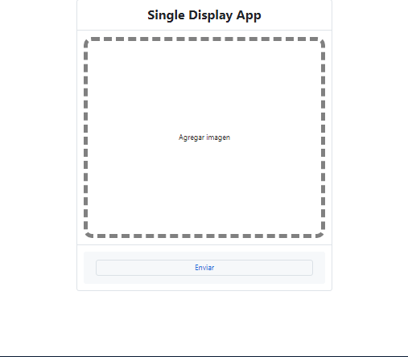

# Aplicacion de visualizacion unica para imagenes o videos

## Creada con SvelteKit y Pocketbase

### Inspirado en la opcion de visualizaciones unicas de fotos y videos en WhatsApp y Telegram

Esta aplicacion permite a los usuarios agregar una imagen o un video y se generara una url de visualizacion unica
esto permite que una vez se acceda a la url la imagen o video se se halla subido de eliminara automaticamente y cuando vuelvan a ingresar a dicha url
la imagen ya no este disponible.

